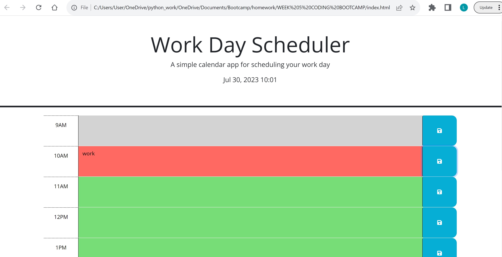

# Calendar App

## Description

Created a calendar app that logs events in terms of timeblocks. Dynamically updates so that it tells 
the user whether a timeblock is in the present, past or future depending on the current hour of day.
When user opens the application, it shows the normal business hours and the current date and time. 
Once refreshed, the events saved into the timeblocks are persistent and stay.

## Screenshot

## Link
[link](https://lwalker107.github.io/Calendar-App-Landen/)